# Deploying a Node.js Todo Application Using Amazon ECR & ECS (Fargate)

## Project Overview

This project demonstrates how to **containerize a Node.js Todo application**, push the Docker image to **Amazon ECR**, deploy it using **Amazon ECS with Fargate**, and **monitor logs using Amazon CloudWatch** for troubleshooting.

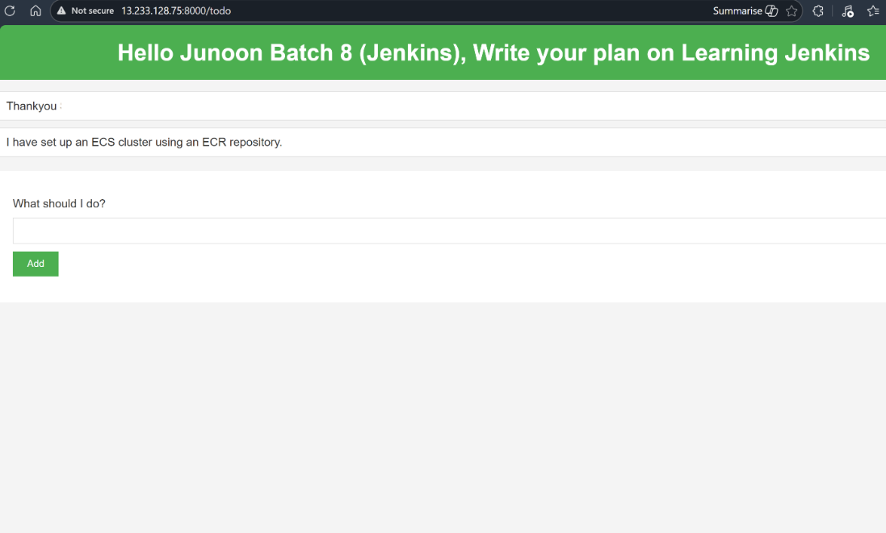


---

## 1. Setup Amazon ECR (Elastic Container Registry)

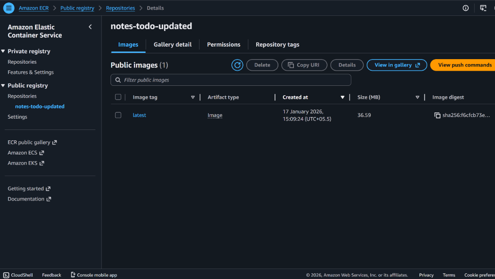


1. Create an ECR repository
   **Repository name:** `node-todo-app`

2. Build and tag the Docker image:

   ```bash
   node-todo-app:latest
   ```

3. Push the Docker image to the ECR repository.

---

## 2. Setup EC2 (For Build & Push Operations)

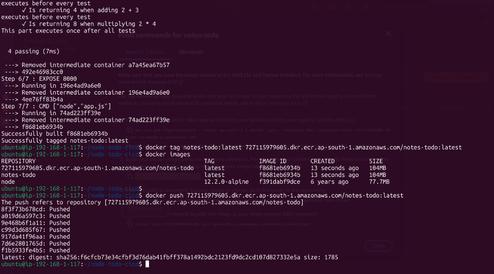

### 2.1 Create an EC2 Instance

* Launch an EC2 instance (Amazon Linux preferred)

### 2.2 Install Required Tools

Install the following packages:

* AWS CLI v2
* Docker

### 2.3 Application Setup

1. Clone the Node.js Todo application repository:

   ```bash
   git clone <todo-app-repo-url>
   ```

2. Configure AWS CLI:

   * Create an IAM user
   * Attach **ECR** and **ECS** policies
   * Configure AWS CLI using access keys

3. Build the Docker image:

   ```bash
   docker build -t node-todo-app:latest .
   ```

4. Authenticate Docker with ECR and push the image to the ECR registry.

---

## 3. Setup Amazon ECS (Elastic Container Service)

### 3.1 Create ECS Cluster

* **Cluster name:** `elastic-rabbit-gj6qi6`
* **Infrastructure:** AWS Fargate

---

## 4. ECS Task Definition

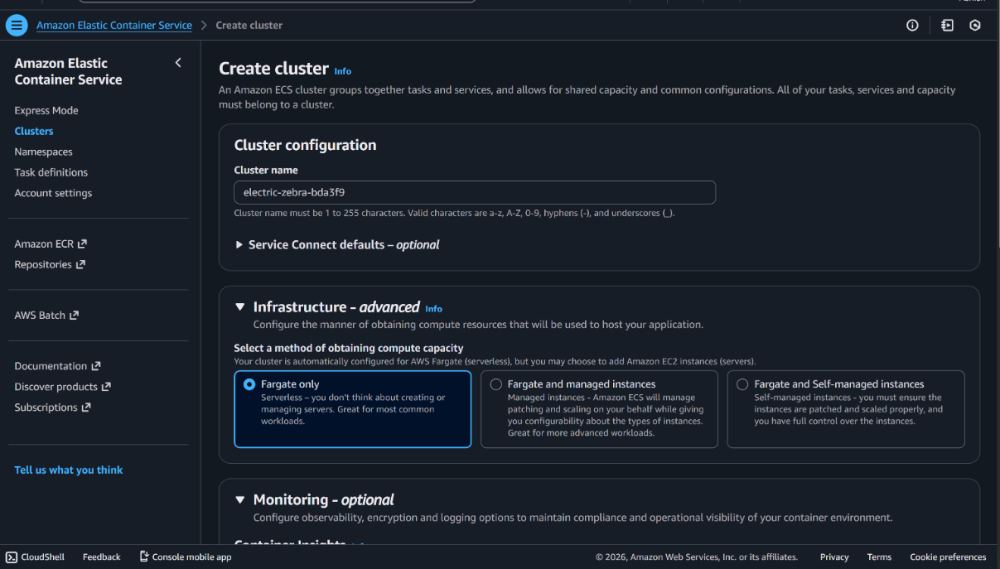


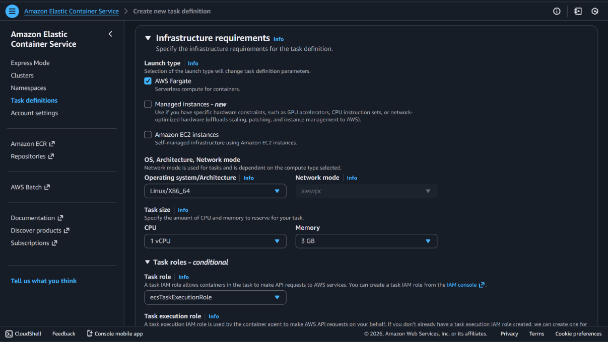


A **Task Definition** is similar to a `docker run` command.
It defines how a container should run in ECS, including image, ports, environment variables, resources, and logging.

### 4.1 Task Definition Configuration

* **Launch type:** AWS Fargate
* **OS architecture:** Linux / x86_64
* **Task size:** 1 vCPU

### 4.2 IAM Task Role

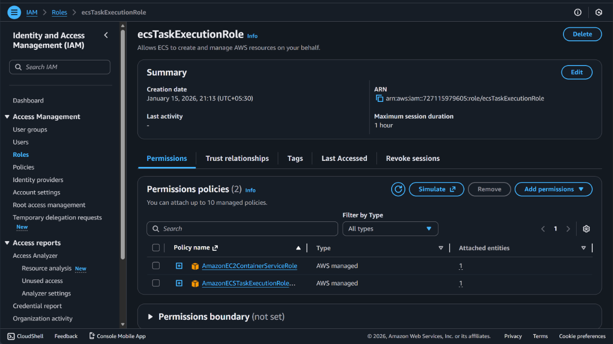


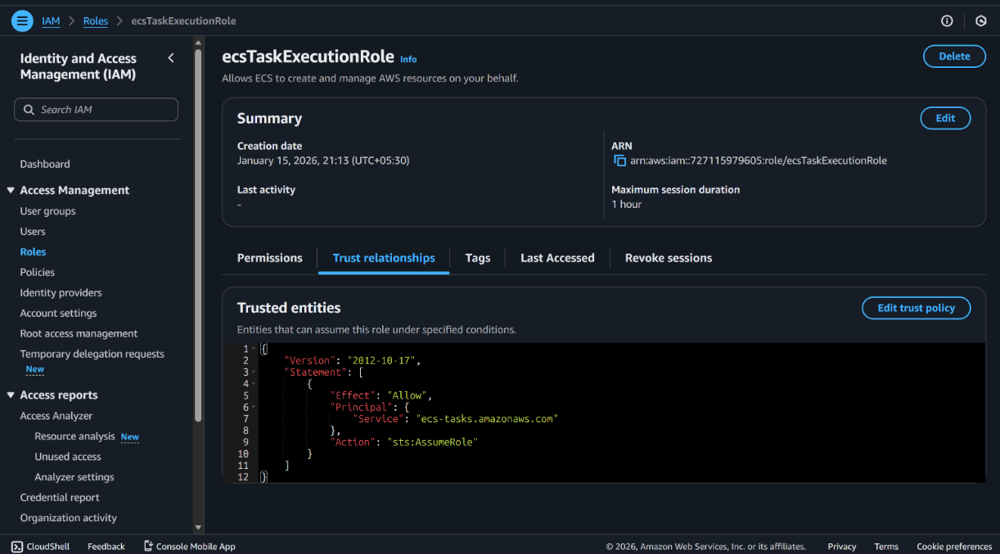


1. Create an IAM role
   **Role name:** `ecsTaskExecution`

2. Attach policies:

* `AmazonECSTaskExecutionRolePolicy`
* `AmazonEC2ContainerServiceFullAccess`

3. Assign this role as the **Task Role**.

---

### 4.3 Container Configuration


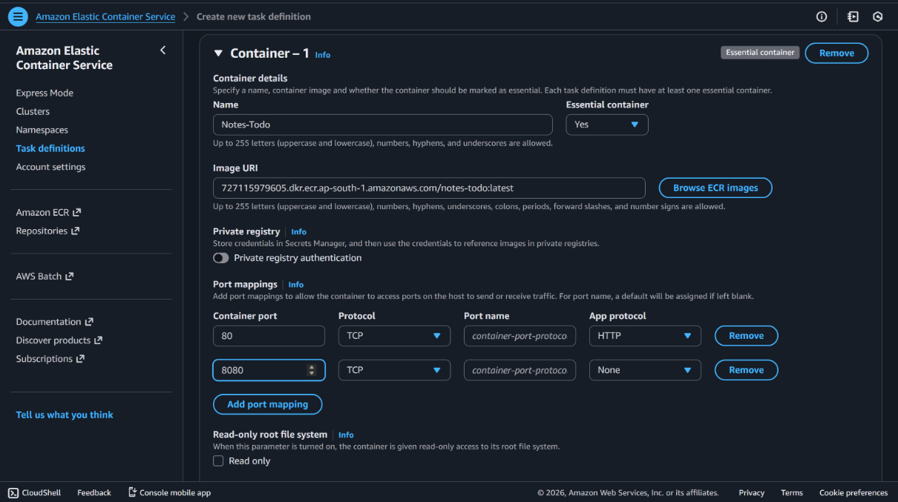


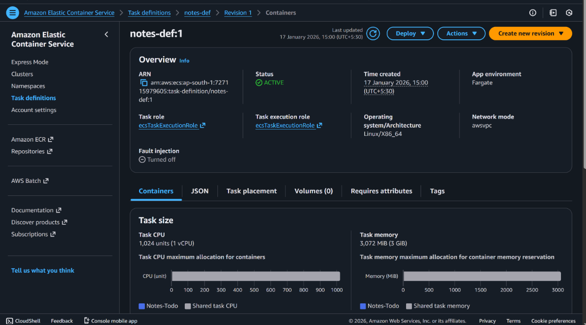


* **Container name:** `Notes-todo`
* **Image:** ECR image URI (`notes-todo_image_url`)
* **Port mapping:**

  * Container port: `8000`
  * Protocol: TCP

#### Logging Configuration (CloudWatch)

* Enable **AWS Logs (CloudWatch Logs)**
* Log group format:

  ```
  /ecs/Notes-todo
  ```
* Log stream:

  ```
  ecs/Notes-todo
  ```

This ensures all container logs are sent to CloudWatch.

Create and register the task definition.

---

## 5. Run Task in ECS Cluster

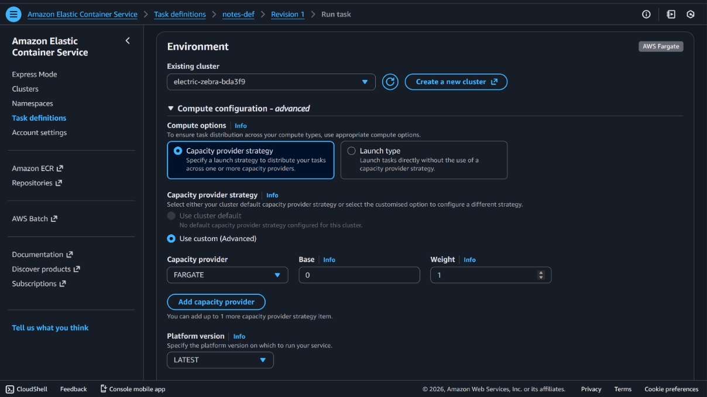


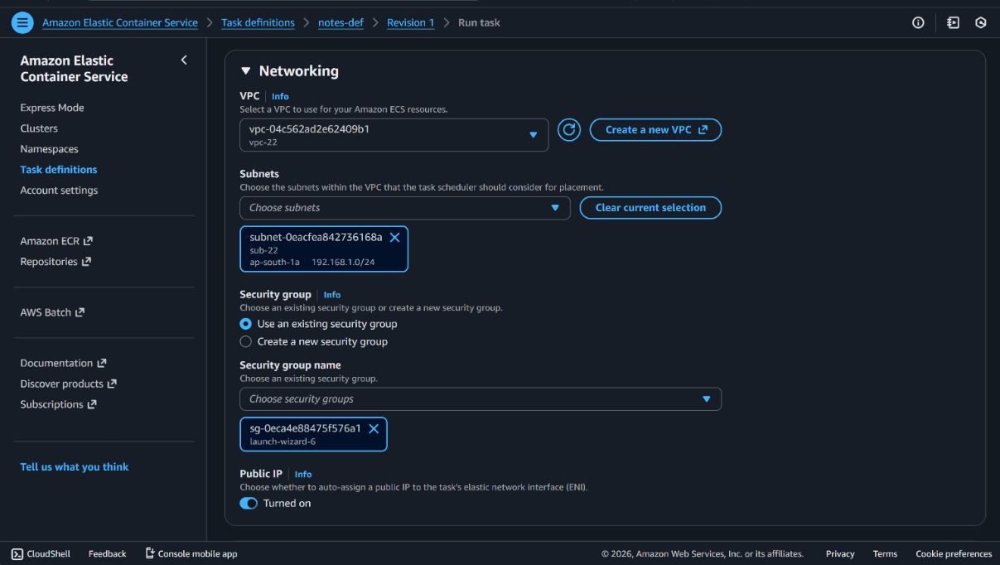


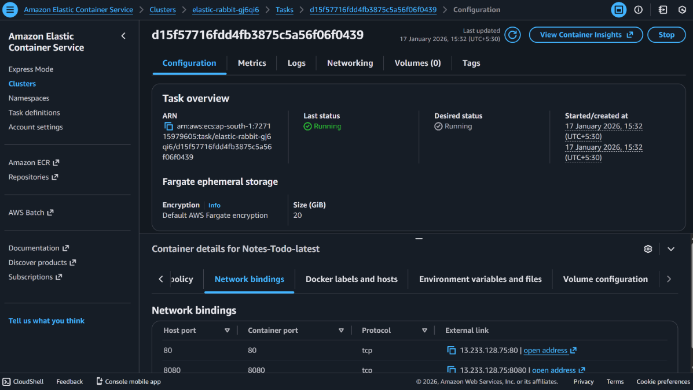


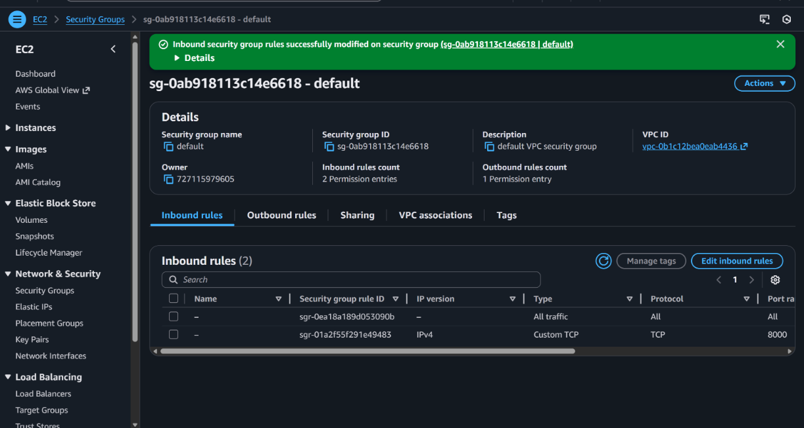


1. Navigate to the ECS cluster: `elastic-rabbit-gj6qi6`
2. Run the task using the created task definition
3. Select:

   * VPC
   * Subnet
   * Security Group

---

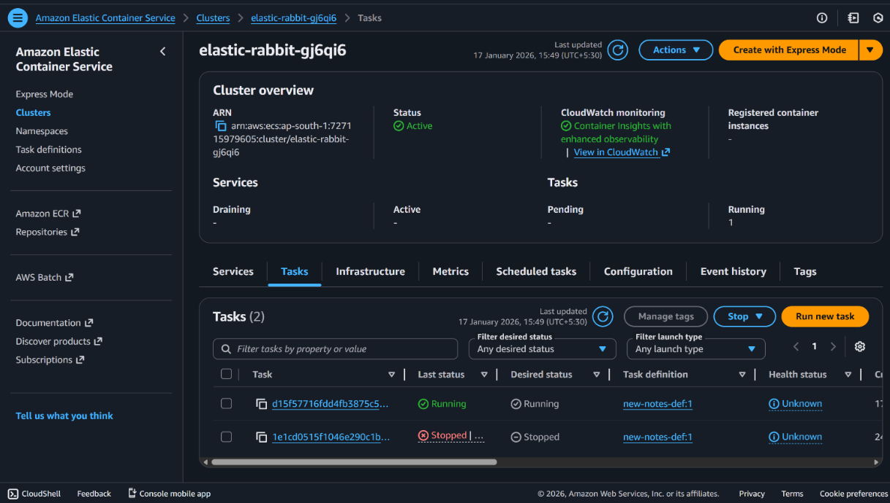


## 6. Security Group Configuration

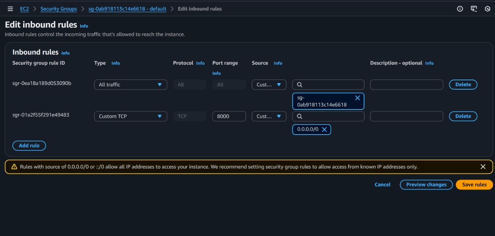


Add an **inbound rule** to the ECS task security group:

* **Port:** `8000`
* **Protocol:** TCP
* **Source:** `0.0.0.0/0` (restrict in production)

---

## 7. Monitoring & Troubleshooting (CloudWatch Logs)

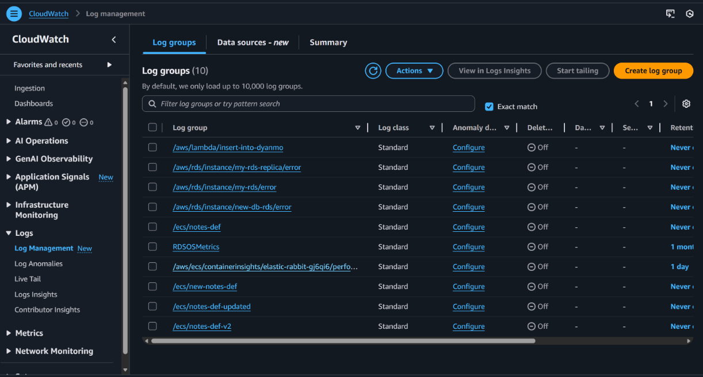


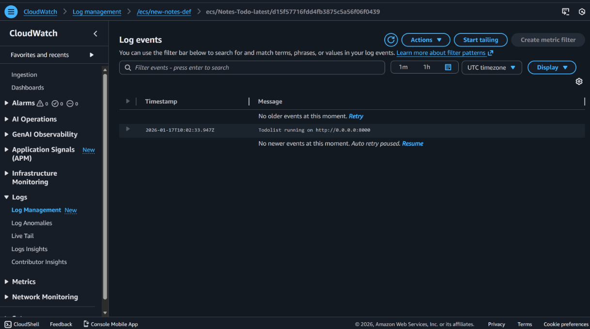


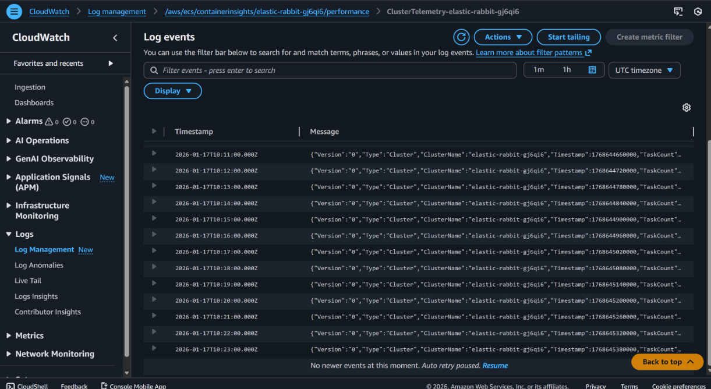


* Verify that **all logs are present in CloudWatch Log Manager**
* Check logs related to:

  * ECS **Cluster**
  * Running **Tasks**
  * Application **Containers**

CloudWatch logs help in:

* Debugging application errors
* Identifying container crashes
* Monitoring startup and runtime issues
* Troubleshooting ECS task failures